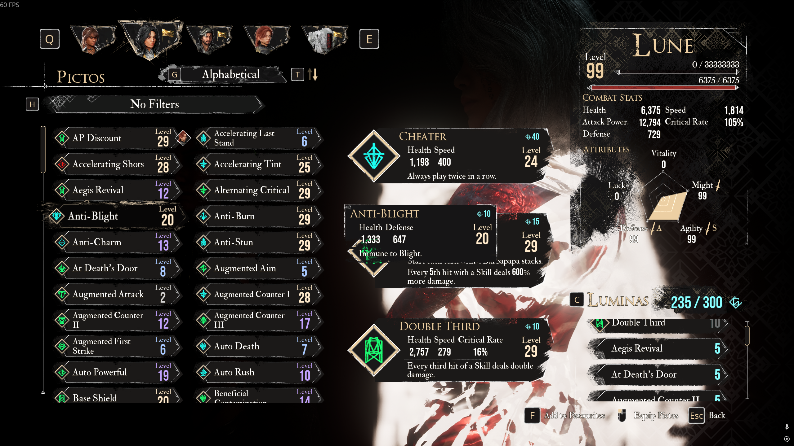

# Expedition 33 Picto Scout 🛡️

**Picto Scout** es una herramienta de automatización diseñada para *Clair Obscur: Expedition 33*. Desplaza automáticamente por tu lista de Pictos (accesorios) dentro del juego, captura capturas de pantalla utilizando OCR (Reconocimiento Óptico de Caracteres) y compara tu colección con una lista maestra para indicarte exactamente qué Pictos te faltan.

## 🚀 Características

*   **Captura Automatizada**: Controla tu ratón para desplazarse por la lista y tomar capturas de pantalla automáticamente.
*   **Detención Inteligente**: Detecta inteligentemente cuando la barra de desplazamiento alcanza el final de la lista y detiene la captura para ahorrar tiempo.
*   **Integración de OCR**: Utiliza `EasyOCR` para leer texto directamente desde la pantalla del juego con alta precisión.
*   **Eliminación de Duplicados**: Filtra automáticamente las entradas duplicadas y limpia el texto.
*   **Comparación con Lista Maestra**: Compara los elementos detectados contra una lista maestra completa basada en la wiki para generar un informe `missing_pictos.txt`.
*   **Lógica Resiliente**: Utiliza coordenadas de pantalla relativas (porcentajes) para funcionar en diferentes resoluciones (probado en 1080p+).

## 📋 Requisitos Previos

*   **Sistema Operativo**: Windows 10/11 (Requerido para la automatización de `pyautogui` en juegos de DirectX).
*   **Python**: Versión 3.8 o superior.
*   **Configuración del Juego**: Ejecuta el juego en modo de **Ventana** o **Ventana sin Bordes** para obtener los mejores resultados con la captura de pantalla.

## 🛠️ Instalación

1.  **Clonar el repositorio**:
    ```bash
    git clone https://github.com/agusnarestha/expedition-33-picto-scout.git
    cd expedition-33-picto-scout
    ```

2.  **Crear un Entorno Virtual** (Recomendado):
    ```bash
    python -m venv venv
    .\venv\Scripts\activate
    ```

3.  **Instalar Dependencias**:
    ```bash
    pip install -r requirements.txt
    ```
    *Las dependencias incluyen: `pyautogui`, `easyocr`, `opencv-python`, `pillow`.*

## 🎮 Uso

1.  **Abrir el Juego**: Inicia *Expedition 33* y navega al menú de **Pictos** para que la lista sea visible.

    
    *¡Asegúrate de que tu pantalla se vea así antes de comenzar!*

2.  **Ejecutar el Scout**:
    ```bash
    python scout.py
    ```
3.  **Seleccionar un Modo**:
    *   **Opción 1: Ejecución Completa (Captura + Proceso + Comparación)**
        *   Elige esta para tu primera ejecución. El script esperará 5 segundos para que cambies a la ventana del juego.
        *   No muevas el ratón durante la fase de captura.
    *   **Opción 2: Proceso + Comparación**
        *   Elige esta si ya tienes capturas de pantalla válidas en la carpeta `output/raw` y solo deseas volver a ejecutar el OCR.
    *   **Opción 3: Solo Comparación**
        *   Elige esta para simplemente verificar nuevamente tu `detected_pictos.txt` existente contra el `master_list.txt`.

4.  **Verificar Resultados**:
    *   **Lista Detectada**: `output/detected_pictos.txt`
    *   **Elementos Faltantes**: `output/missing_pictos.txt`

## ✅ Probado En

*   **Sistema Operativo**: Windows 11
*   **Resolución**: 1920x1080 (Full HD) y 2560x1440 (2K)
*   **Versión del Juego**: Última versión de Steam (a partir de enero de 2026)

## 📂 Estructura del Proyecto

*   `scout.py`: Script principal para captura y OCR.
*   `compare.py`: Lógica de coincidencia difusa para la comparación de listas.
*   `master_list.txt`: Base de datos de todos los Pictos conocidos (actualizado desde [Fextralife Wiki](https://expedition33.wiki.fextralife.com/Pictos)).
*   `output/`: Almacena todas las capturas de pantalla e informes de texto.


## 🐞 Problemas y Solución de Errores

Si encuentras un error, resultados incorrectos del OCR o detecciones faltantes, consulta lo siguiente primero:

### Problemas Comunes

* **El OCR omite algunos Pictos**
  * Asegúrate de que el juego se esté ejecutando en modo de **Ventana** o **Ventana sin Bordes**.
  * Evita la configuración de desenfoque de movimiento o escalado de la interfaz que reduzca la claridad del texto.
  * Asegúrate de que la lista esté completamente visible y no cubierta parcialmente por superposiciones.

* **El desplazamiento se detiene demasiado temprano o demasiado tarde**
  * La resolución de pantalla o la escala de la interfaz pueden ser diferentes.
  * Intenta ajustar el retraso del desplazamiento o el umbral de detección en `scout.py`.

* **Falsos positivos / nombres incorrectos**
  * El OCR es difuso por naturaleza: los nombres similares pueden leerse incorrectamente.
  * La lógica de comparación utiliza coincidencia difusa, pero se recomienda la verificación manual.

### Informar Problemas

Si el problema persiste, abre un Issue en GitHub e incluye:

* Tu **Sistema Operativo y resolución**
* **Modo de visualización del juego** (Ventana / Sin bordes)
* Una **captura de pantalla** de tu menú de Pictos
* Registros relevantes o archivos de salida (`detected_pictos.txt`)

👉 Abre un issue aquí:  
https://github.com/agusnarestha/expedition-33-picto-scout/issues


## ⚠️ Descargo de Responsabilidad

Esta herramienta utiliza reconocimiento de imágenes y automatización del ratón. Interactúa con el cliente del juego solo tomando capturas de pantalla y simulando entradas del botón de desplazamiento. Úsalo responsablemente.
