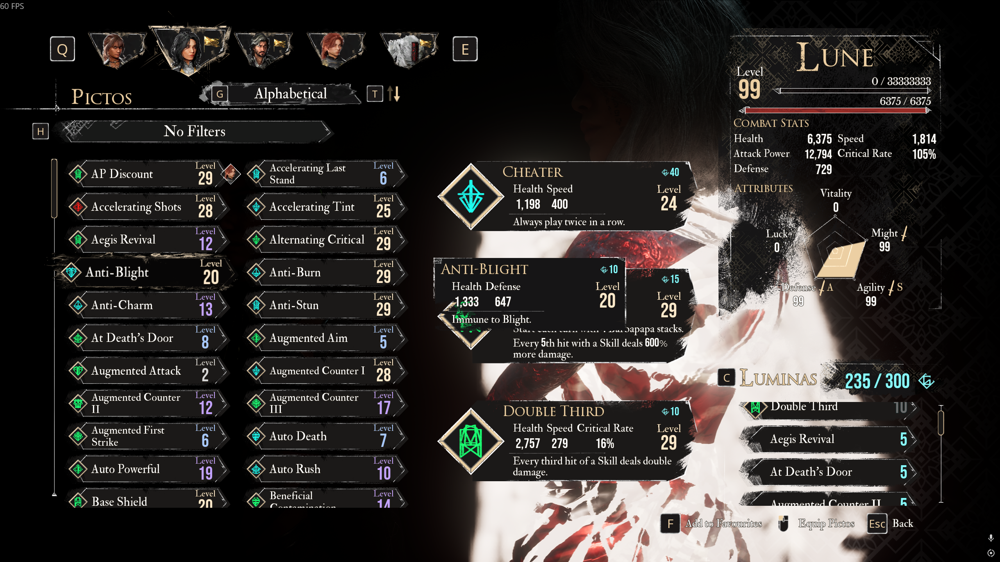

# Expedition 33 Picto Scout 🛡️

**Picto Scout** is an automation tool designed for *Clair Obscur: Expedition 33*. It automatically scrolls through your in-game list of Pictos (accessories), captures screenshots using OCR (Optical Character Recognition), and compares your collection against a master list to tell you exactly which Pictos you are missing.

## 🚀 Features

*   **Automated Capture**: Controls your mouse to scroll through the list and take screenshots automatically.
*   **Smart Stop**: Intelligently detects when the scroll bar reaches the bottom of the list and stops capturing to save time.
*   **OCR Integration**: Uses `EasyOCR` to read text directly from the game screen with high accuracy.
*   **Duplicate Removal**: Automatically filters out duplicate entries and cleans up text.
*   **Master List Comparison**: Compares your detected items against a comprehensive wiki-based master list to generate a `missing_pictos.txt` report.
*   **Resilient Logic**: Uses relative screen coordinates (percentages) to work on different resolutions (tested on 1080p+).

## 📋 Prerequisites

*   **OS**: Windows 10/11 (Required for `pyautogui` automation in DirectX games).
*   **Python**: Version 3.8 or higher.
*   **Game Settings**: Run the game in **Windowed** or **Borderless Windowed** mode for best results with screen capture.

## 🛠️ Installation

1.  **Clone the repository**:
    ```bash
    git clone https://github.com/agusnarestha/expedition-33-picto-scout.git
    cd expedition-33-picto-scout
    ```

2.  **Create a Virtual Environment** (Recommended):
    ```bash
    python -m venv venv
    .\venv\Scripts\activate
    ```

3.  **Install Dependencies**:
    ```bash
    pip install -r requirements.txt
    ```
    *Dependencies include: `pyautogui`, `easyocr`, `opencv-python`, `pillow`.*

## 🎮 Usage

1.  **Open the Game**: Launch *Expedition 33* and navigate to the **Pictos** menu so the list is visible.

    
    *Make sure your screen looks like this before starting!*

2.  **Run the Scout**:
    ```bash
    python scout.py
    ```
3.  **Select a Mode**:
    *   **Option 1: Full Run (Capture + Process + Compare)**
        *   Choose this for your first run. The script will wait 5 seconds for you to switch to the game window.
        *   Do not move your mouse during the capture phase.
    *   **Option 2: Process + Compare**
        *   Choose this if you already have valid screenshots in the `output/raw` folder and just want to re-run the OCR.
    *   **Option 3: Compare Only**
        *   Choose this to simply re-check your existing `detected_pictos.txt` against the `master_list.txt`.

4.  **Check Results**:
    *   **Detected List**: `output/detected_pictos.txt`
    *   **Missing Items**: `output/missing_pictos.txt`

## ✅ Tested On

*   **OS**: Windows 11
*   **Resolution**: 1920x1080 (Full HD) & 2560x1440 (2K)
*   **Game Version**: Latest Steam Release (as of Jan 2026)

## 📂 Project Structure

*   `scout.py`: Main script for capture and OCR.
*   `compare.py`: Fuzzy matching logic for list comparison.
*   `master_list.txt`: Database of all known Pictos (updated from [Fextralife Wiki](https://expedition33.wiki.fextralife.com/Pictos)).
*   `output/`: Stores all screenshots and text reports.


## 🐞 Issues & Troubleshooting

If you encounter a bug, incorrect OCR results, or missing detections, please check the following first:

### Common Issues

* **OCR misses some Pictos**
  * Ensure the game is running in **Windowed** or **Borderless Windowed** mode.
  * Avoid motion blur or UI scaling settings that reduce text clarity.
  * Make sure the list is fully visible and not partially covered by overlays.

* **Scrolling stops too early or too late**
  * Screen resolution or UI scale may differ.
  * Try adjusting the scroll delay or detection threshold in `scout.py`.

* **False positives / incorrect names**
  * OCR is fuzzy by nature—similar-looking names may be misread.
  * The comparison logic uses fuzzy matching, but manual verification is recommended.

### Reporting Issues

If the problem persists, please open a GitHub Issue and include:

* Your **OS & resolution**
* **Game display mode** (Windowed / Borderless)
* A **screenshot** of your Pictos menu
* Relevant logs or output files (`detected_pictos.txt`)

👉 Open an issue here:  
https://github.com/agusnarestha/expedition-33-picto-scout/issues


## ⚠️ Disclaimer

This tool uses image recognition and mouse automation. It interacts with the game client only by taking screenshots and simulating scroll wheel inputs. Use responsibly.

